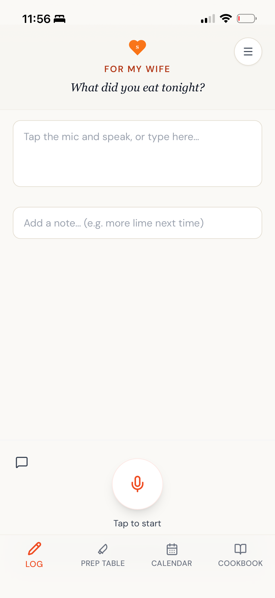

# Recipe Rhythm

> Mobile-first meal planner with voice-first daily logging, AI-powered recipe parsing, and household-aware grocery lists.

[](LICENSE)
[](.github/workflows/e2e.yml)
[](.github/workflows/design-system-lint.yml)

**Live demo:** [recipe-rhythm.vercel.app](https://recipe-rhythm.vercel.app)

Recipe Rhythm is a mobile-first, single-user meal-tracking and weekly meal-planning web application. Built to function as a personal digital cookbook and meal log, it leverages AI to easily categorize your meals and suggest future plans based on your eating habits.

## About this project

Recipe Rhythm is an AI-assisted codebase, and I want to be upfront about what that means. I'm a Senior User Researcher by background — 7+ years at Google and Meta, with research origins at SRI International — not a career engineer. I built this for my wife: she was my primary stakeholder and the app's North Star, and her actual cooking, planning, and shopping behaviors were what I tested every product decision against. That focus shaped real calls — for example, deliberately *omitting* precise ingredient quantities from recipes (the usability cost of detailed measurements outweighed the completeness benefit), and identifying grocery-list generation as the highest-leverage feature to add by listening for what she *needed* instead of what she *asked for*. The product specs in [`docs/prds/`](docs/prds/), the architecture decisions in [`docs/adr/`](docs/adr/), and the workflow methodology in [`CLAUDE.md`](CLAUDE.md) are mine. The line-by-line implementation was generated by Anthropic's Claude, directed by me through a spec-and-review workflow.

If you're reviewing this with a hire in mind, read a PRD or ADR alongside the code it produced — that's where my judgment lives.

<!--
  Screenshots — uncomment this block once images are added to docs/screenshots/.
  Suggested files: vault.png, brainstorm.png, log.png (mobile-sized PNGs work best, e.g. 375×812).

| Vault | Brainstorm | Log |
| :---: | :---: | :---: |
|  |  |  |

-->

## Core Features
1. **Log**: Low-friction "what did you eat tonight?" capture. Saves to a local meal history table, and an optional "Save to Cookbook" prompt uses AI to classify and store the meal with rich details.
2. **Prep Table (Brainstorm)**: The planning surface. Select your days, automatically generate suggestions based on your Vault history and recommendations engine, and finalize your meal plan. Share via native share sheet or export a categorized grocery list.
3. **Cookbook (Vault)**: Your personal recipe library. Each recipe has component metadata (cuisine, flavor, proteins, cooking method, etc.) auto-filled using the Anthropic API.

## Tech Stack
- **Frontend**: React 19, Vite 8, Tailwind CSS 3, framer-motion, `@dnd-kit` (drag-and-drop), `react-modal-sheet`
- **Backend & Auth**: Supabase (Postgres, Auth, Storage), with owner-scoped Row-Level Security on every table
- **AI Integration**: Anthropic API — Claude Sonnet 4.6 for recipe parsing, Claude Haiku 4.5 for smaller classification calls. Server-side proxy keeps API keys out of the client bundle.
- **Hosting**: Vercel (static client + serverless API routes); local-dev mirror via Express
- **Testing**: Vitest + React Testing Library (unit/integration), Playwright (e2e), GitHub Actions for CI
- **UI**: `lucide-react` for icons, mobile-first responsive design, PWA-installable

## Architecture & Planning

This project is documented end-to-end, from product vision to per-phase implementation prompts:

- **[Architecture overview](docs/architecture.md)** — system diagram and how the pieces fit together
- **[Project status (shipped vs. pending phases)](docs/STATUS.md)** — single source of truth for what's live
- **[Product Requirements Documents](docs/prds/)** — feature specs (Vault, Meal Planning, Grocery Tracking, etc.)
- **[Architecture Decision Records](docs/adr/)** — rationale behind non-trivial design choices
- **[Database schema reference](docs/schema.md)** — running schema doc, updated with every migration

## Setup Instructions

1. **Install Dependencies**
   ```bash
   npm install
   ```

2. **Environment Variables**
   Copy `.env.example` to `.env` and fill in your values.
   - `VITE_SUPABASE_URL`: Your Supabase project URL.
   - `VITE_SUPABASE_ANON_KEY`: Your Supabase anonymous API key. (Ensure Row-Level Security is enabled on all tables!)
   - `ANTHROPIC_API_KEY`: Your Anthropic API key, used by the backend proxy.

3. **Start Development Server**
   Runs both the Vite client and the Express API server proxy concurrently.
   ```bash
   npm run dev
   ```
   Client will run on `http://localhost:5173`. API proxy will run on `http://localhost:3001`.

## Database Schema (Supabase)
To fully run this project, ensure you have the following configured in Supabase:
- **`meals` table**: `id`, `user_id`, `name`, `notes`, `vault_id`, `eaten_on`
- **`vault` table**: `id`, `user_id`, `name`, `image_url`, `cuisine_type`, `flavor_profile`, `proteins`, `cooking_method`, `main_carb`, `dietary_tags`, `dairy_components`, `vegetables`, `fruits`, `auto_completed`, `is_wildcard`, `notes`, `recipe_url`, `created_at`
- **`meal_plans` table**: `id`, `user_id`, `served_at`, `finalized_at`
- **`meal_plan_items` table**: `id`, `meal_plan_id`, `scheduled_date`, `name`, `item_id` (foreign key to vault), `is_wildcard`, `source_url`, `cooked`, `period_start`, `period_end`
- **Storage Bucket**: Create a public bucket named `recipe_images` with a permissive authenticated INSERT policy.

The complete, current schema (including all PRD-driven additions) is tracked in [`docs/schema.md`](docs/schema.md).

## Testing
- Unit tests: `npm run test:unit`
- E2E tests: `npm run test:e2e` (Playwright)

## Deployment
For production, the client can be hosted on platforms like Vercel or Netlify. Ensure the API proxy is either hosted via a Serverless Edge Function (e.g., using `vercel.json` and `/api/` directories) or as a standalone Node.js service. The Anthropic API key must remain out of the client bundle.

This project is deployed on Vercel at [recipe-rhythm.vercel.app](https://recipe-rhythm.vercel.app).

## License

MIT — see [LICENSE](LICENSE) for details.
